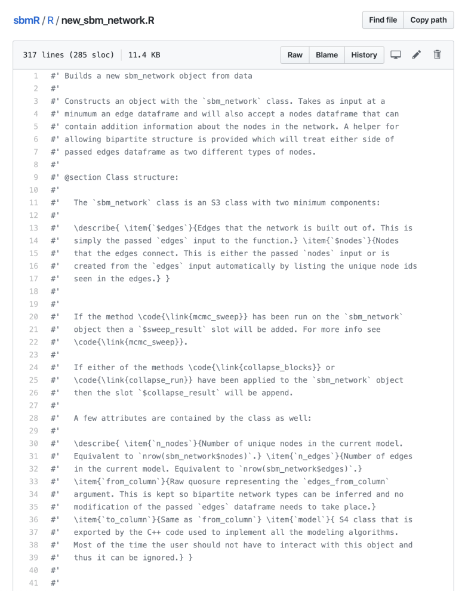

```{r setup, include = FALSE}
knitr::opts_chunk$set(
  fig.dim=c(5, 4), 
  fig.retina=2, 
  out.width="100%",
  message=FALSE,
  warning=FALSE,
  eval = FALSE
  # ,
  # cache = TRUE
  )

library(knitr)
set.seed(42)
```
class: middle

## Building a software package in tandem with machine learning methods research can result in both more rigorous code and more rigorous research. 

_Nick Strayer, PhD Candidate, Vanderbilt Biostatistics_


---

class: middle

# Layout


- What am I selling?
- The Why 
- The Process
- The Product

---
# About Me

.pull-left[

## Career
Previously:
- Software Engineering
- NY Times Graphics Department

Now:
- PhD. Candidate, Biostatistics
- Focused on Visualization and Unsupervised learning
]

.pull-right[
## Links
- Blog at [LiveFreeOrDichotomize.com](https://livefreeordichotomize.com/)
- Tweet at [@nicholasStrayer](https://twitter.com/NicholasStrayer)
- Code at [github.com/nstrayer](https://github.com/nstrayer)
]


---
class: middle


# What am I selling?

---
class: middle 


## An Idea 

.pull-left[

![:spacePx 80]
Building an R package alongside a research project serves to strengthen both the package and the research. 

]

.pull-right[
.center[
.iconed[💭]
]
]


---
class: middle

## A Thing 

.pull-left[

![:spacePx 80]
`sbmR`: an R package to perform uncertainty-aware unsupervised clustering of graph data. 
]

.pull-right[
.center[
.iconed[📦]
]
]


---


class:middle

# The Why

Why a project gets started

---

class: middle


# But first... Jargon Break!

---

# Bi or Poly-partite networks

> Networks that have nodes of multiple distinct types where connections can't form between nodes of the same type. 


---

# The __S__tochastic __B__lock __M__odel?

A network model to cluster nodes into "blocks". 


---


# An equation for validity

<div style="margin-top:-75px;">

</div>

---

# Really why I showed an equation


---
class: middle


## Why did I start this project?

---
# Why SBMs

.pull-left[

![:spacePx 50]
- Working with Electronic Health Records (EHR) data

- Questions like "who are these people similar to and why?"

- Needed method that acknowledges the limitations of the data. 
]
.pull-right[
![:spacePx 50]


]


---
class: middle

# Why write a package?

.pull-left[

No tool existed that:

- Was for R

- Focused on uncertainty

- Allowed us to develop custom methods for bipartite networks etc. 

]
.pull-right[
.center[.iconed[📦]]
]

	
	
---
class: middle

# The Process

---
class: middle

# Laying your foundation 🧱

---
class: middle

## Deciding supporting libraries
.pull-left[

![:spacePx 20]

iGraph is a monolith
- Adding computationally heavy steps in R brought it to a halt 
  
![:spacePx 20]
  
Decided to write algorithms from scratch using `Rcpp`
 
  
]
.pull-right[
  
]

---
class: middle

.pull-left[

![:spacePx 90]

## Scafolding with `usethis`

_Use good defaults to setup a solid foundation_

]

.pull-right[
  
]


---

## `usethis::use_testthat()`

.pull-left[
![:spacePx 180]
No excuses to not have tests...
]
.pull-right[

]

---
## `usethis::use_roxygen_md()`

.pull-left[

![:spacePx 160]

Write your documentation with as little friction to publication as possible

]
.pull-right[
![:spacePx 50]
.shadowed[

]
]


---

## `usethis::use_data_raw()`

.pull-left[

![:spacePx 170]

Setup a consistent workflow for simulations and testing datasets
  
]

.pull-right[
.shadowed[

]
]


---
class: middle

# Finding errors early .bullet_emoji[🕵️‍♀️]

---

## Unit tests build understanding


.pull-left[

![:spacePx 50]

- Toy examples to test basic functions 

![:spacePx 30]

- Builds strong foundations for larger models


![:spacePx 30]


- Solidifies intuition about behavior

]
.pull-right[

<div class = "shadowed" style="margin-top: -5rem; margin-right: -1rem;">

</div>
]


---
class: middle

## Simulated data exposes software flaws


.pull-left[

![:space 10]

- Stochastic data _will_ find your edge cases


![:space 5]


- Gives an idea of real-world performance

![:space 5]

- Forces you to think about scope early

]
.pull-right[


]

---
class: middle

# Getting speedy with it .bullet_emoji[🚀]

---
class: middle


## Be a translator


.pull-left[

![:spacePx 40]
.bullet_emoji[🧮] Written math is not optimized for the binary world of computers

![:spacePx 50]


.bullet_emoji[🛠] Reworking for efficiency leads to better understanding

]
.pull-right[

]

---
class: middle

## Be a copy-editor

![:space 3]


.bullet_emoji[🧐] Question the purpose of every operation, they are expensive

![:space 5]


---
class: middle

# You still have to write... .bullet_emoji[✍️]

---

# Doc driven development

.pull-left[

![:spacePx 100]


.bullet_emoji[📷] Keeps you focused on the big picture


![:spacePx 50]

.bullet_emoji[👃] An informal sniff-test for results
]

.pull-right[

]


---

# Vignette or perish

.pull-left[

![:spacePx 80]


.bullet_emoji[🥀] If no-one knows __how__ to use your package/method no-one __will__ use it. 
![:spacePx 80]


.bullet_emoji[🖍] Once you're done, you have written a lot

]


<div class = "pull-right" style = "margin-top: -5em;">

</div>

---

class: middle

# The Product

---

# `sbmR`

.pull-left[

![:spacePx 70]

- R package to fit SBMs

- Investigates uncertainty of found structure by sampling from bayesian posterior

- Provides (a growing list of) visualizations to communicate results

![:spacePx 30]
]

.pull-right[

]


---

## A pkgdown website

.pull-left[

![:spacePx 40]

### [tbilab.github.io/sbmR/](https://tbilab.github.io/sbmR/)

![:spacePx 20]

- All the docs and vignettes accessible online

- Don't have to download entire package to see if it does what you want
]


.pull-right[


.shadowed[

]
]

---

## Manuscripts


.pull-left[
![:spacePx 20]

- Glue together your work

![:spacePx 20]

- "Scripts available upon request" becomes `install_github(...)`

![:spacePx 20]

- Not the only avenue for dissemination 
]

.pull-right[
![:spacePx 100]

.shadowed[

]
]

---
class: middle

# The dangers

---

## Too much time is spent fiddling

![:spacePx 60]

- `usethis` and strong defaults help a lot

![:spacePx 60]

- Ask "would I end up doing this later anyways?"

![:spacePx 60]

- Set a list of requirements and make you way through it


---

## My project isn't strictly methods development

![:spacePx 100]
- The package infrastructure works well for general data-science projects

![:spacePx 60]
- See [Karthik Ram's work on compendiums](http://inundata.org/talks/rstd19/#/). 

---

## I've never made a package before!

![:spacePx 80]

- It's easier than you may think:
  - http://r-pkgs.had.co.nz/ 
  
  
![:spacePx 60]

- If you want people to use your method, an R package is the most effective way to do so


---

# The Appendix

## Thanks to
.pull-left[
- My advisor Yaomin Xu
- Lab Biostatistician Siwei Zheng
- Other lab members for thoughtful comments during entire process
- Vanderbilt Biostatistics Development Grant
- My Cat (and wife)
]

.pull-right[

]


